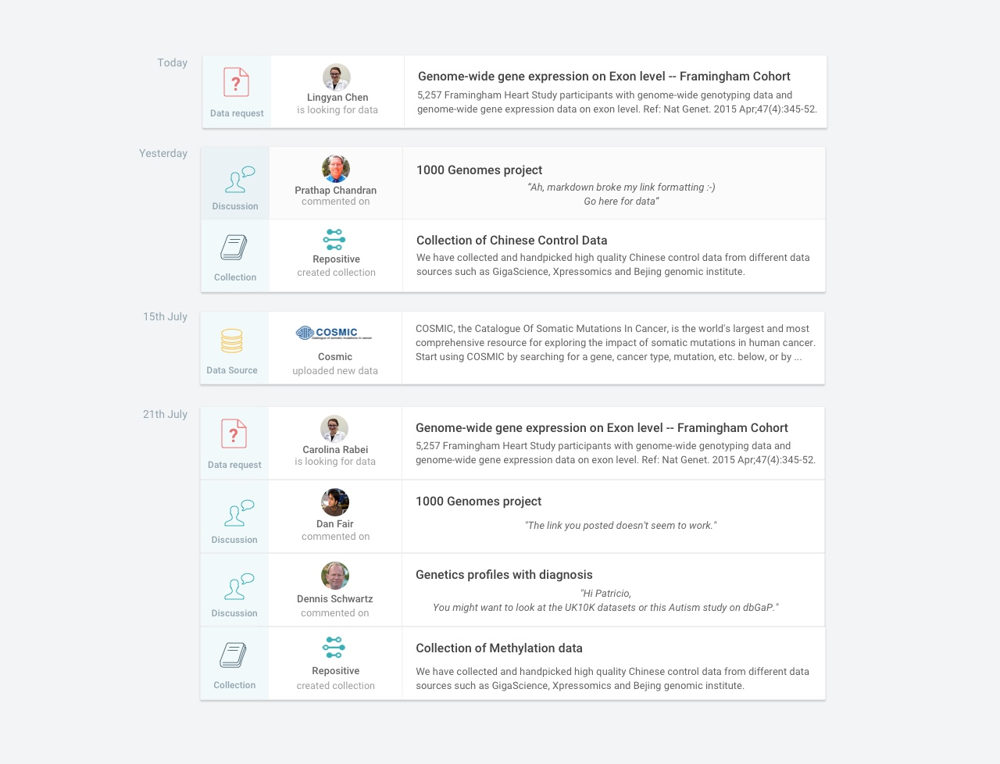

## Preamble

Below you’ll see a mockup of a feature we’d like to add to our app. It’s a newsfeed, listing a bunch of different activities that have happened on the platform.

This view needs data from a few different data models:

- **Users:** Represents a user of the platform (see [schema](schemas/user.schema.json))
- **Datasets:** Represents a dataset on the platform (see [schema](schemas/dataset.schema.json))
- **Requests:** Represents a request (this is like asking a question on a forum) that a user has made on the platform (see [schema](schemas/request.schema.json))
- **Discussion:** Represents a comment contributed to a discussion. Comments can be made on datasets & forum requests (see [schema](schemas/discussion.schema.json))
- **Collection:** Represents a group of datasets (see [schema](schemas/collection.schema.json))
- **Datasource:** Represents the organisation publishing genomic data (see [schema](schemas/datasource.schema.json))

To get the data for this view, you can imagine making a request to an API endpoint for the list of activities:

**GET** `<domain>/feed`:
 - On success:
   - Code: `200`
   - Content type: `application/json`
   - Body: [feed_array](schemas/feed.schema.json)
 - On error:
   - Code: `401 | 500 | 502`
   - Content type: `application/json`
   - Body: [error schema](schemas/error.schema.json)

and making a request to an API endpoint for each of the data models:

**GET** `<domain>/<object_name>/<id>`:
 - On success: Returns a single entity for the given id
   - Code: `200`
   - Content type: `application/json`
   - Body: Matching object schema
 - On error:
   - Code: `401 | 404 | 500 | 502`
   - Content type: `application/json`
   - Body: [error schema](schemas/error.schema.json)

### Aim of Exercise
The aim of this exercise is to build the view displayed in the above mockup:

- Build a UI that shows an activity feed grouped by day.
- Mock the API requests (you don’t need to implement any backend code, just mock the calls to it) to the data models
- Take into account that each of the requests will hit a different service with variable response times, uptime rates & may return an error.
- Don’t worry too much about matching icons, text & images to the design - we won’t judge you on this. Just use dummy text & fake names and, if you’d like to include some icons, use the Material Design icon library (the [file](https://material.io/icons/#ic_insert_drive_file), [person](https://material.io/icons/#ic_person), [book](https://material.io/icons/#ic_library_books) icons might be useful).
- Feel free to use whichever technologies you wish (including frameworks, libraries, preprocessors - whatever you want).

##### Time Limit
You have 5 hours to complete this exercise. We’ll measure the time from the first commit to the last commit.

There’s a lot to do so don’t worry if you don’t finish everything. We’ll be interested to see what you prioritise and why.

##### Resources
You don’t have to use it but we’ve included some [basic CSS](base.css) to get you going, with font styles, color variables & spacing classes. We’ve also included example API [responses](examples) and their [schemas](schemas).

## How it will be reviewed

After the exercise, we’ll arrange a call to discuss your solution (as soon as possible after the exercise, depending on your availability). We’ll ask questions like:

- what makes your solution scalable, maintainable & robust?
- what are the drawbacks of your solution?
- with more time, what could you do to improve your solution?

When you’re working on your solution, you should also think about:

 - Handling of modularity and complexity
 - Readability and coherence of the code style
 - Managing state
 - CSS composition
 - What to and what not to test and how to test it
 - Documentation (if you think it’s appropriate)
