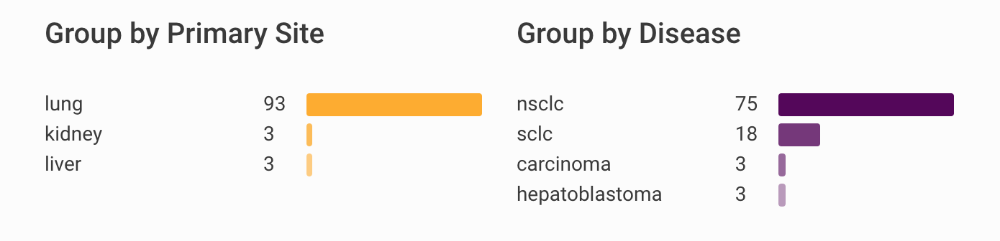

# React Frontend Exercise

## Before you start coding

- Create a public Git repository on Github or your Git hosting platform of choice, as long as it's publicly accessible.
- Use [`create-react-app`](https://github.com/facebook/create-react-app) to create a React application skeleton on your development machine:

  ```bash
  npx create-react-app frontend_exercise_implementation
  ```

- Work on your own and push commits regularly to your fork.
- Once you are done provide running instructions! This is super important, if the code doesn't run, it's not done.
- You do not need to do anything else, we can access your repository and review the results there. You have full control over the code, so please, do not remove your repository until we give you feedback!

## The exercise

Below there is and image with the design of what you'll be building.



The aim of this exercise is to create a histogram. The histogram represents a set of words and the number of occurrences of each word.

You will receive anbject in the following format:

```js
{
  "title": 'Pets in Cambridge',
  "data": {
    "cat": 55,
    "dog": 14,
    "lizard": 37, // There are a lot of Liz lovers in Cambridge. :D
    "elephant": 3
  }
}
```

Notice that the elements of the data object are not sorted and that the amount of unique entities is unspecified and could range from 1 to ∞.

Create the histogram using the previous object meeting the criteria:

- The histogram shows a given title
- Each row consists of 3 elements:
  - The word
  - The number of occurances of the word
  - A bar representing the relative size of an element in the set.
- The elements are sorted in descending order, so that the largest bar is on top.

Build first a minimal solution without taking into consideration the colour or the bars or other consmetic details.

## Extensions

#### You don't need to pick the task in order, pick them as better suits your style and interests.

- Add unit tests.
- Create multiple histograms each histogram has a different base colour.
- The colour of the bars should fade from dark to light, descending for the first five elements, the following elements use the color of the element in the fifth position.
- If more than 5 bars need to be rendered on a single histogram, collapse them and provide an UI control to expand the view.
- Request the data from an API endpoit:
  - Design the API interface and write down the specification.
  - Mock the frontend requests to the API using such specification.

## What we take into consideration:

#### Note that the order of the apearance of the items doesn't correlate with the importance with assign to them.

- Testing, preferably TDD and with focus on failure instead of success cases.
- Data manipulation strategies.
- Code style, composition vs inheritance and oo vs functional methodologies
- Treatment of logic vs state.
- Understanding of DOM manipulation.
- Understanding of CSS composition.
- Legibility and maintainability of the code.
- Understanding of async and how to deal with callback hells.
- During testing, mocking methodologies and API faking strategies.
- Version control management.
